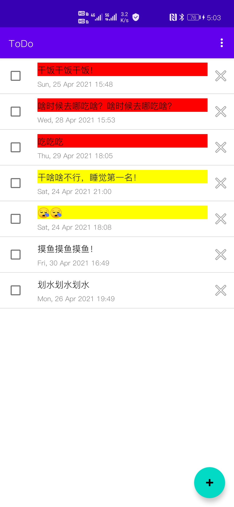
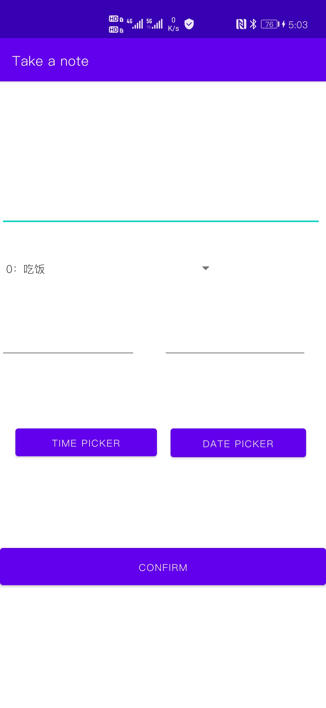
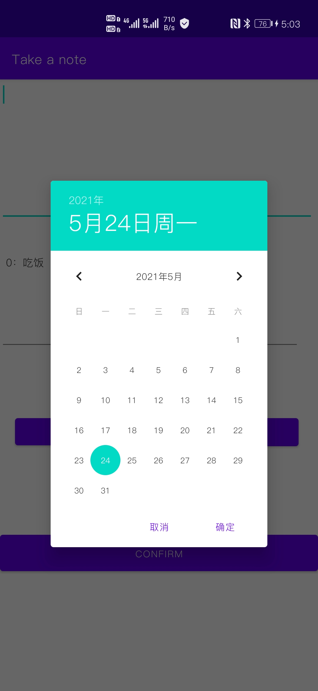

# ToDo
一个todo软件，使用了Room持久性库！

# 截图


<div style="display:grid;grid-template-columns:repeat(3, 33%);">



</div>

# 特点
1. 使用room持久性库访问数据库

2. 数据库操作放到

   ```
   MainScope().launch(Dispatchers.IO) {
       //数据库操作
   }
   ```

3. 每个条目可编辑！

4. 可以显示还有多少时间到期！